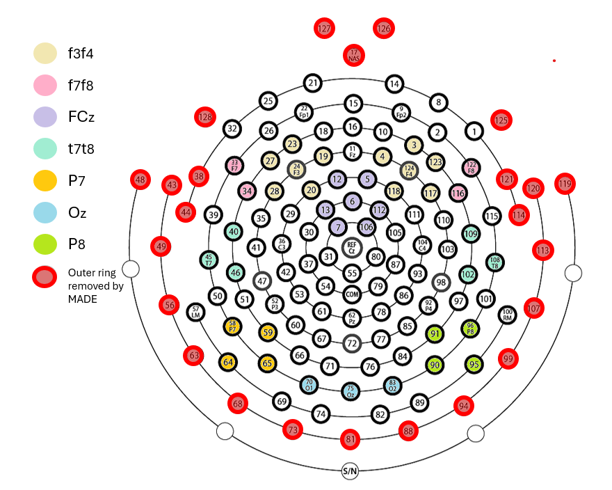

# Derivatives and ERP specifications

## Derivatives by task

`HBCD-EEG-Utilities.m` computes the following derivatives for each task: 

| Task | Derivatives     |
|------|----------------|
| FACE | SME, Mean amplitude            |
| MMN  | SME, Mean amplitude           |
| VEP  | SME, Mean amplitude, Adaptive mean, Peak latency            |
| RS   | Absolute power (μV²), Power (dB), Natural log power |

Click [here](https://docs.hbcdstudy.org/measures/eeg/) to view descriptions of each task. 

- **Mean amplitude**: Mean amplitude (μV) during specified measurement window.

- **Adaptive mean**: Adaptive mean amplitude is calculated by finding the peak during the specified time window and averaging the amplitude across all sampling points within 1 standard deviation of the peak.

- **Peak latency**: Latency (ms) to the peak amplitude during the specified time window.

- **SME**: Standardized Measurement Error (SME) is a universal measure of data quality for ERP data. See [Luck et al., 2021](https://onlinelibrary.wiley.com/doi/full/10.1111/psyp.13793) for more information.

- **Power**: Absolute power (μV²), power (dB), and natural log power for each frequency bin ranging from 1-50Hz.
 
## Regions of Interest (ROIs)

See below for the ROIs that are used to compute ERPs. The full list of ROIs can also be found on the [GitHub repository for HBCD-MADE](https://github.com/DCAN-Labs/HBCD-MADE/blob/main/proc_settings_HBCD.json).

 
 
## Task Derivatives

**Please note that most ERPs are scored using age-dependent time-windows.** ERPs are computed separately for all task conditions in the FACE and MMN task. See tables below for details. 

ERP derivatives for the MMN, FACE, and VEP tasks contain the following components at the specified time windows and ROIs:

### FACE ERP Derivatives

#### V03, V04, V06

| Task | Component | Time window | ROIs         | Age (months) |
|------|-----------|-------------|--------------|-------------------|
| FACE | N290      | 200-350 ms  | P8, P7, Oz   | 3-30              |
| FACE | P400      | 350-600 ms  | P8, P7, Oz   | 3-30              |    
| FACE | NC        | 300-600 ms  | FCz          | 3-30              |  

### MMN ERP Derivatives

#### V03
| Task | Component | Conditions | Time window | ROIs                 | Age (months) |
|------|-----------|-----------|-------------|----------------------|-------------------|
| MMN  | MMR1      | PreDeviant, Deviant, Standard       | 100-200 ms  | f7f8, f3f4, FCz      |  3-9              |
| MMN  | MMR2      | PreDeviant, Deviant, Standard       | 200-400 ms  | t7t8, f7f8, f3f4, FCz|  3-9              |

#### V04, V06
| Task | Component | Conditions | Time window | ROIs                 | Age (months) |
|------|-----------|-------------|-------------|----------------------|-------------------|
| MMN  | MMR1      | PreDeviant, Deviant, Standard       | 100-200 ms  | t7t8, f7f8, f3f4, FCz|  9-30             |
| MMN  | MMR2      | PreDeviant, Deviant, Standard       | 200-450 ms  | t7t8, f7f8, f3f4, FCz|  9-30             |

- Users are advised to score the amplitude of the Mismatch Response (MMR) component by subtracting the amplitude of PreDeviant trials from Deviant trials.

### VEP ERP Derivatives

#### V03
| Task | Component | Time window | ROIs                 | ERP Direction | Age (months)     |
|------|-----------|-------------|----------------------|---------------|-----------------------|
| VEP  | N1        | 40-79 ms    | Oz                   |   Negative    | 3-9                   |
| VEP  | P1        | 80-140 ms   | Oz                   |   Positive    | 3-6                   |
| VEP  | P1        | 80-120 ms  | Oz                    |   Positive    | 6-9                   |
| VEP  | N2        | 141-300 ms  | Oz                   |   Negative    | 3-6                   |
| VEP  | N2        | 121-170 ms  | Oz                   |   Negative    | 6-9                   |

#### V04, V06
| Task | Component | Time window | ROIs                 | ERP Direction | Age (months)     |
|------|-----------|-------------|----------------------|---------------|-----------------------|
| VEP  | N1        | 40-79 ms    | Oz                   |   Negative    | 9-30                  |
| VEP  | P1        | 80-120 ms   | Oz                   |   Positive    | 9-30                  |
| VEP  | N2        | 121-170 ms  | Oz                   |   Negative    | 9-30                  |


### RS Power Derivatives

Power values are calculated as follows:

```{r}

Absolute Power (μV²) = (μV²  / Hz)

Log Power  = log10 (1 + (μV²  / Hz))

Power (dB) = 10 × log10 (μV² / Hz)

```


 
 