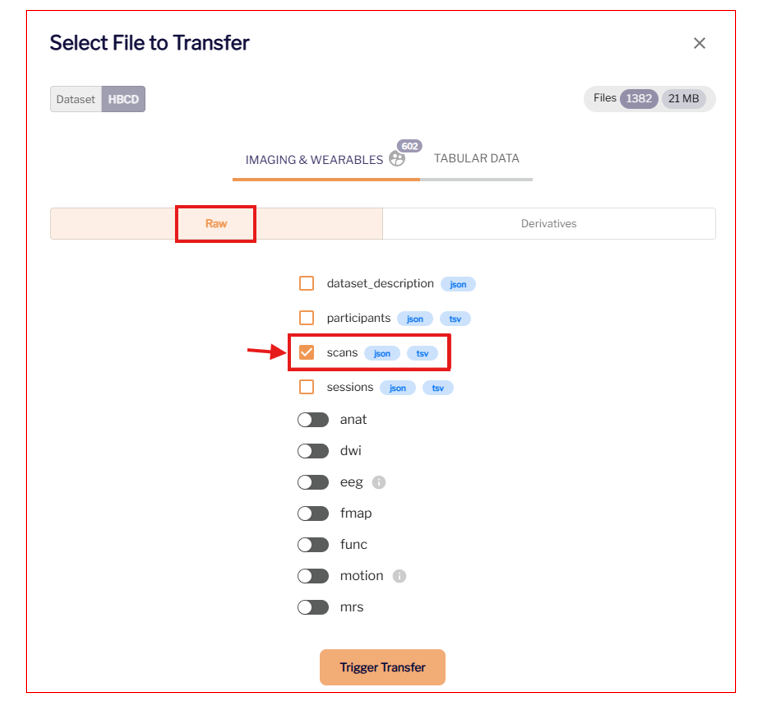

#How to download HBCD EEG Data

## Downloading EEG data from Lasso 

Please see the central [HBCD Data Release Docs](https://docs.hbcdstudy.org/data_access/) for instructions to access and download HBCD data.

1- Log into Lasso.

2- In the 'Query Data' tab, select "Choose Files For Download". 
 
 
3- Under "Raw", download the ``scans.tsv`` file for each participant. 
 
 
4- Under "Derivatives", download the eeg ``.set`` files. 
 
 
5- Select "Trigger Transfer". Download using [Globus Share](https://docs.hbcdstudy.org/data_access/lasso/#globus-share-download) or the [Lasso Download Client](https://hbcd-docs.readthedocs.io/data_access/lasso/#download-client-user-guide-macos-version). 
 