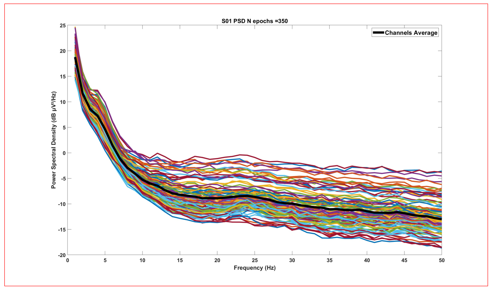

# Expected Outputs from `HBCD-EEG-Utilities.m`

`HBCD-EEG-Utilities.m` writes the following output files: 
 
    |__ made/
        |__ sub-<label>/ #individual subject folder
        |    |
        |    | # FACE
        |    |__ sub-<ID>_ses-V03_task-FACE-ERPSummaryStats.csv
        |    |__ sub-<ID>_ses-V03_task-FACE-ERPTrialMeasures.csv
        |    |
        |    | # MMN
        |    |__ sub-<ID>_ses-V03_task-MMN-ERPSummaryStats.csv
        |    |__ sub-<ID>_ses-V03_task-MMN-ERPTrialMeasures.csv
        |    |
        |    | # VEP
        |    |__ sub-<ID>_ses-V03_task-VEP-SummaryStats.csv
        |    |__ sub-<ID>_ses-V03_task-VEP-ERPTrialMeasures.csv
        |    |
        |    | # RS
        |    |__ sub-<ID>_ses-V03_task-RS-LogPowerSpectra.csv
        |    |__ sub-<ID>_ses-V03_task-RS-AbsPowerSpectra.csv
        |    |__ sub-<ID>_ses-V03_task-RS-dbPowerSpectra.csv
        |    |__ sub-<ID>_ses-V03_task-RS-spectra.mat
        |    |__ sub-<ID>_ses-V03_task-RS-desc-allCh_PSD.jpg
        |
        |__ Concatenated outputs for ERPs/ #output folder created by HBCD-EEG-Utilities.m
            |
            | # MMN
            |__MMN_ERP_V03_<yyyy-mm-dd>.csv
            |__MMN_trialMeasures_V03_<yyyy-mm-dd>.csv
            |
            | # FACE
            |__FACE_ERP_V03_<yyyy-mm-dd>.csv
            |__FACE_trialMeasures_V03_<yyyy-mm-dd>.csv
            |
            | # VEP
            |__VEP_ERP_V03_<yyyy-mm-dd>.csv
            |__VEP_trialMeasures_V03_<yyyy-mm-dd>.csv
            

# Output by task 

Click [here](https://github.com/Child-Development-Lab/HBCD-EEG-Utilities/blob/main/docs/csv_data_dictionary_derivatives.csv) for a data dictionary defining the fields in each .csv output file. 

### Faces task (FACE)

**1- FACE Trial Measures Output**: `sub-<ID>_ses-V03_task-FACE-ERPTrialMeasures.csv`

Trial-level derivatives for the FACE task include mean amplitude.

| Variable Name | Description                              |
|---------------|------------------------------------------|
| Condition | inverted, object, uprightInv, uprightObj |
| TrialNum | trial index |
| MeanAmplitude_<WindowStart-WindowEnd>_ROI | Mean amplitude within specified time window at specified ROI |

**2- FACE Summary Statistics Output**: `sub-<ID>_ses-V03_task-FACE-ERPSummaryStatistics.csv`

Subject-level derivatives for the FACE task include mean amplitude and SME.

| Variable Name | Description                              |
|---------------|------------------------------------------|
| Condition | inverted, object, uprightInv, uprightObj |
| NTrials | number of trials retained per condition |
| MeanAmplitude_WindowStart-WindowEnd_ROI | Mean amplitude within specified time window at specified ROI |
| SME_WindowStart-WindowEnd_ROI | Standard measurement error during specified time window at specified ROI |

### Mismatch Negativity (MMN)

**1- MMN Trial Measures Output**: `sub-<ID>_ses-V03_task-MMN-ERPTrialMeasures.csv`

Trial-level derivatives for the MMN task include mean amplitude.

| Variable Name | Description                              |
|---------------|------------------------------------------|
| Condition | deviant, predeviant, standard |
| TrialNum | trial index |
| MeanAmplitude_WindowStart-WindowEnd_ROI | Mean amplitude within specified time window at specified ROI |

**2- MMN Summary Statistics Output**: `sub-<ID>_ses-V03_task-MMN-ERPSummaryStatistics.csv`

Subject-level derivatives for the MMN task include mean amplitude and SME.

| Variable Name | Description                              |
|---------------|------------------------------------------|
| Condition | deviant, predeviant, standard |
| NTrials | number of trials retained per condition |
| MeanAmplitude_WindowStart-WindowEnd_ROI | Mean amplitude within specified time window at specified ROI |
| SME_WindowStart-WindowEnd_ROI | Standard measurement error during specified time window at specified ROI |

### Visual Evoked Potential (VEP)

**1- VEP Trial Measures Output**: `sub-<ID>_ses-V03_task-VEP-ERPTrialMeasures.csv`

Trial-level derivatives for the VEP task include mean amplitude, adaptive mean (peak), and latency.

| Variable Name | Description                              |
|---------------|------------------------------------------|
| Condition | VEP |
| TrialNum | trial index |
| MeanAmplitude_WindowStart-WindowEnd_ROI | Mean amplitude within specified time window at specified ROI |
| Peak_WindowStart-WindowEnd_ROI | Adaptive mean amplitude within specified time window at specified ROI |
| Latency_WindowStart-WindowEnd_ROI | Latency to peak within specified time window at specified ROI |

**2- VEP Summary Statistics Output**: `sub-<ID>_ses-V03_task-VEP-ERPSummaryStatistics.csv`

Subject-level derivatives for the VEP task include SME, mean amplitude, adaptive mean (peak), and latency.

| Variable Name | Description                              |
|---------------|------------------------------------------|
| Condition | VEP |
| NTrials | number of trials retained per condition |
| SME_WindowStart-WindowEnd_ROI | Standard measurement error during specified time window at specified ROI |
| MeanAmplitude_WindowStart-WindowEnd_ROI | Mean amplitude within specified time window at specified ROI |
| Peak_WindowStart-WindowEnd_ROI | Adaptive mean amplitude within specified time window at specified ROI |
| Latency_WindowStart-WindowEnd_ROI | Latency to peak within specified time window at specified ROI |

### Resting State 

**1- RS Absolute Power (μV²) Spectra Output**: `sub-<ID>_ses-V03_task-RS-AbsPowerSpectra.csv`

Subject-level absolute power values for RS.  
   
| Variable Name | Description                              |
|---------------|------------------------------------------|
| Row | Electrode | 
| 1.0 Hz | Sum of absolute power in μV² centered at 1 Hz (within the 0.5hz to 1.5hz freq range) at corresponding electrode site |
| 2.0 Hz | Sum of absolute power in μV² centered at 2 Hz (within the 1.5hz to 2.5hz freq range) at corresponding electrode site |
| 3.0 Hz | Sum of absolute power in μV² centered at 3 Hz (within the 2.5hz to 3.5hz freq range) at corresponding electrode site |
| ... | and so on... |

**2- RS Power (dB) Spectra Output**: `sub-<ID>_ses-V03_task-RS-dbPowerSpectra.csv`

Subject-level dB power values for RS.  
   
| Variable Name | Description                              |
|---------------|------------------------------------------|
| Row | Electrode |
| 1.0 Hz | Sum of power in dB centered at 1 Hz (within the 0.5hz to 1.5hz freq range) at corresponding electrode site |
| 2.0 Hz | Sum of power in dB centered at 2 Hz (within the 1.5hz to 2.5hz freq range) at corresponding electrode site |
| 3.0 Hz | Sum of power in dB centered at 3 Hz (within the 2.5hz to 3.5hz freq range) at corresponding electrode site |
| ... | and so on... |

**3- RS Log Power Spectra Output**: `sub-<ID>_ses-V03_task-RS-LogPowerSpectra.csv`

Subject-level log power values for RS.  
   
| Variable Name | Description                              |
|---------------|------------------------------------------|
| Electrode | Electrode label |
| 1.0 Hz | Sum of natural log power centered at 1 Hz (within the 0.5hz to 1.5hz freq range) at corresponding electrode site |
| 2.0 Hz | Sum of natural log power centered at 2 Hz (within the 1.5hz to 2.5hz freq range) at corresponding electrode site |
| 3.0 Hz | Sum of natural log power centered at 3 Hz (within the 2.5hz to 3.5hz freq range) at corresponding electrode site |
| ... | and so on... |

**4- RS Power Spectra .mat Output**: `sub-<ID>_ses-V03_task-RS_spectra.mat`

Epoch-level derivatives for RS.
   
| Variable Name | Description                              |
|---------------|------------------------------------------|
| avg_abs_pow | Average absolute power (μV²) across epochs |
| avg_log_pow | Average natural log power across epochs |
| avg_db_pow | Average power (dB) across epochs |
| all_abs_power | Channels x abs power x epochs |
| all_log_power | Channels x log power x epochs |
| all_db_pow | Channels x dB power x epochs |
| epoch_level_abs_pow | Absolute power (μV²) for each epoch |
| epoch_level_log_pow | Log power for each epoch |
| epoch_level_db_pow | Power (dB)  for each epoch |
| channel locations | ... |
| freqs | Frequency bins (1hz increments, 1-50hz) |
| n_epochs | Number of epochs |
| Fs | Sampling rate |
| num_channels | Number of channels |

**5- RS Power Spectra Figure** : `sub-<ID>_ses-V03_task-RS-desc-allCh_PSD.jpg`

Subject-level plot visualizing power spectral density for each channel across the 1-50Hz frequency range. Data for this plot originates from `sub-<ID>_ses-V03_task-RS-dbPowerSpectra.csv`. See below for an example:
 
