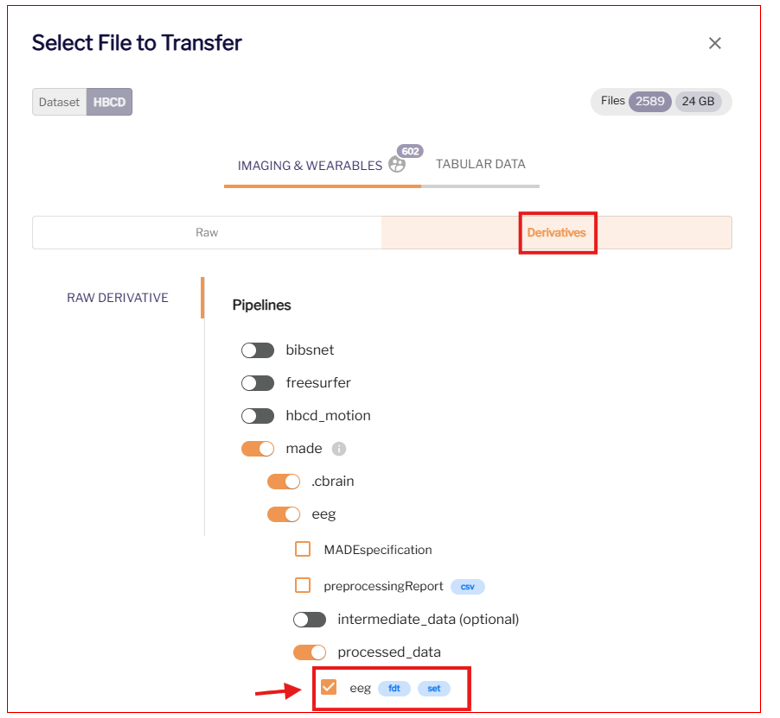

#Usage & Tutorial

## Required BIDS Input Data

Required inputs are ``scans.tsv`` files and EEG ``.set`` and ``.fdt`` files for each subject. See below for instructions to download these files.

## Downloading EEG data from Lasso 

Please see the central [HBCD Data Release Docs](https://docs.hbcdstudy.org/data_access/) for instructions to access and download HBCD data.

1- Log into Lasso.

2- In the 'Query Data' tab, select "Choose Files For Download". 
 
 
3- Under "Raw", download the ``scans.tsv`` file for each participant. 
 
 
4- Under "Derivatives", download the eeg ``.set`` files. 
 
 
5- Select "Trigger Transfer". Download using [Globus Share](https://docs.hbcdstudy.org/data_access/lasso/#globus-share-download) or the [Lasso Download Client](https://hbcd-docs.readthedocs.io/data_access/lasso/#download-client-user-guide-macos-version). 
 
## Execution in Matlab

1- Install HBCD-EEG-Utilities and its dependencies: see [Installation](https://hbcd-eeg-utilities.readthedocs.io/en/latest/installation/).

2- Open `HBCD-EEG-Utilities.m` by double-clicking the file, and press the green 'Run' button on the 'Editor' toolbar.

 
 
3- Select file path to ``derivatives/made`` folder downloaded from Lasso. This folder contains eeg ``.set`` files.
 

4- Select file path to the ``rawdata`` folder downloaded from Lasso. This folder contains ``scans.tsv `` files. 
 

5- If prompted, select the path to where you downloaded EEGLAB. 

6- Select the tasks for which you wish to compute derivatives. 
 

7- Wait for the script to finish. **This could take up to 2 hours if processing all tasks for all release subjects.**

8- Find derivative output in the following folders:
 
    |__ made/
        |__ sub-<label>/ #subject-level output
        |__ Concatenated outputs for ERPs/ #concatenated output
            
See [Descriptions of output](https://hbcd-eeg-utilities.readthedocs.io/en/latest/expected-outputs/) for details. 