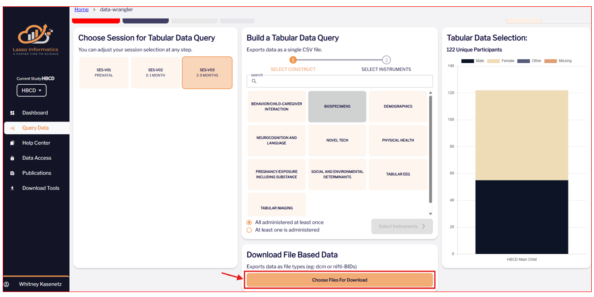

#Tutorial

## Download EEG data from Lasso 

Please see the central [HBCD Data Release Docs](https://hbcd-docs.readthedocs.io/data_access/) for instructions to access and download HBCD data.

1. Log into Lasso

2. In the Lasso 'Query Data' tab, select "Choose Files For Download". 

 
 
3. Under "Raw", download the ``scans.tsv`` file for each participant. 

 
 
4. Under "Derivatives", download the eeg ``.set`` files. 
 
 
 
5. Select "Trigger Transfer". Download using [Globus Share](https://hbcd-docs.readthedocs.io/data_access/lasso/#globus-share-download) or the [Lasso Download Client](https://hbcd-docs.readthedocs.io/data_access/lasso/#download-client-user-guide-macos-version). 
 
## Running the script 

1. Install HBCD-EEG-Utilities and its depedencies: see [Installation](https://childdevlab-hbcd-eeg-utilities.readthedocs.io/en/latest/installation/).

2. Open `HBCD-EEG-Utilities.m` and press the green 'Run' button on the 'Editor' toolbar. To open the `HBCD-EEG-Utilities.m`, double click on the file.

 
 
3. Follow the prompts to select the tasks you wish to use, and the file path to the ``rawdata`` and ``derivatives/made`` folders downloaded from Lasso. If prompted, select the path to where you downloaded EEGLAB. Then, select the tasks for which you wish to compute derivatives. 

4. Wait for the script to finish. This could take up to 2 hours if processing all tasks for all release subjects. 

5. Find derivative output in the output location you selected. 

