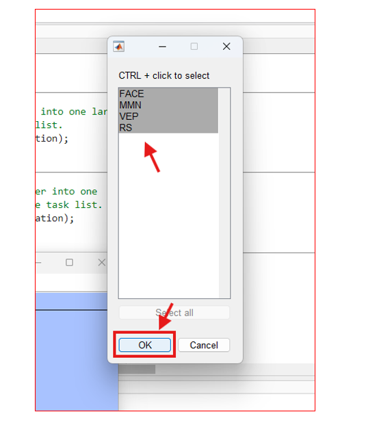

#Tutorial

Required inputs are EEG ``.set`` files and ``scans.tsv`` files for each subject. See below for instructions to download these files.

## Download EEG data from Lasso 

Please see the central [HBCD Data Release Docs](https://hbcd-docs.readthedocs.io/data_access/) for instructions to access and download HBCD data.

1- Log into Lasso

2- In the 'Query Data' tab, select "Choose Files For Download". 
 
 
3- Under "Raw", download the ``scans.tsv`` file for each participant. 
 
 
4- Under "Derivatives", download the eeg ``.set`` files. 
 
 
5- Select "Trigger Transfer". Download using [Globus Share](https://hbcd-docs.readthedocs.io/data_access/lasso/#globus-share-download) or the [Lasso Download Client](https://hbcd-docs.readthedocs.io/data_access/lasso/#download-client-user-guide-macos-version). 
 
## Running the script 

1- Install HBCD-EEG-Utilities and its depedencies: see [Installation](https://childdevlab-hbcd-eeg-utilities.readthedocs.io/en/latest/installation/).

2- Open `HBCD-EEG-Utilities.m` and press the green 'Run' button on the 'Editor' toolbar. To open the `HBCD-EEG-Utilities.m`, double click on the file.

 
 
3- Select file path to ``derivatives/made`` folder downloaded from Lasso. This folder contains eeg ``.set`` files.
 

3- Select file path to the ``rawdata`` folder downloaded from Lasso. This folder contains ``scans.tsv `` files. 
 

4- If prompted, select the path to where you downloaded EEGLAB. 

5- Select the tasks for which you wish to compute derivatives. 
 

6- Wait for the script to finish. **This could take up to 2 hours if processing all tasks for all release subjects.**

7- Find derivative output in the following folders:
 
    |__ made/
        |__ sub-<label>/ #subject-level output
        |__ Concatenated outputs for ERPs/ #concatenated output
            
See [Descriptions of output](https://childdevlab-hbcd-eeg-utilities.readthedocs.io/en/latest/expected-outputs/) for details. 